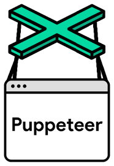

<div align="center">
  <a>
    
  </a>

  <h3 align="center">Web Scraping using puppeteer and swagger</h3>


# Sobre o Projeto

O projeto tem como objetivo extrair informações dos produtos disponíveis no site [Open Food Facts](https://world.openfoodfacts.org/), utilizando tecnologias como Puppeteer para realizar a extração e o Swagger para documentação da API.


# Tecnologias Usadas
* 
* 
* 
* 

# Começando

## Pré Requisitos

Ter o Node.js saiba mais em https://nodejs.org
Ter o Git instalado saiba mais em https://git-scm.com

## Instalação

1. Clone o repositorio
```sh
   git clone https://github.com/agdaLopes/puppeteerswaggerapi.git
```

2. Instale o Express:
```sh
   npm install express
```

3. Instale o Puppeter:
```sh
   npm install puppeter
```

4. Instale o Swagger UI Express:
```sh
   npm install swagger-ui-express
```

5. Instale o YAMLjs:
```sh
   npm install yamljs
```

6. Instale o body-parser(para processar solicitações POST):
```sh
   npm install body-parser
```

7. Instale o Swagger-jsdoc:
```sh
   npm install swagger-jsdoc
```

## Como Rodar o Projeto

```sh
   node puppeteerswagger.js
```

## API

### Acessar o Swagger UI
```sh
   http://localhost:8080/api-docs/
```

### Acessar a lista de produtos
```sh
   localhost:8080/products
```

### Filtar produtos
```sh
   localhost:8080/products?nutrition=A&nova=1
```

### Acessar o produto atravez do ID
```sh
   localhost:8080/products/3155250349793
```
